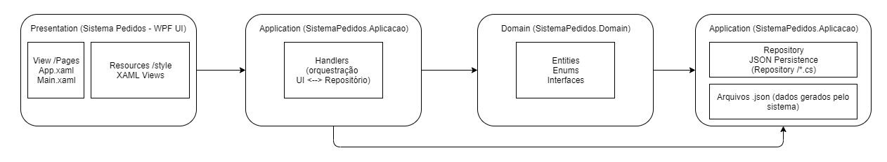

# Sistema de Pedidos

Aplicação em WPF para gerenciamento de Pessoas, Produtos e Pedidos.

# Resumo das telas

- Home (mini dashboard)


- Pessoas
  - Listagem de pessoas (busca e filtros).
  - Cadastro / Edição / Visualização.


- Produtos
  - Listagem de produtos (busca e filtros).
  - Cadastro / Edição / Visualização.


- Pedidos
  - Listagem de pedidos com filtros (pessoa, status, forma de pagamento e período).
  - Cadastro / Visualização / Alteração de status.
  - Gerenciamento de itens do pedido.


# Persistência de dados

- A gravação dos dados é feita em arquivos `.json` gerados automaticamente pelo próprio sistema no diretório do aplicativo (normalmente na mesma pasta do executável ou no diretório de trabalho da aplicação). Os arquivos contêm as entidades persistidas (ex.: pessoas, produtos, pedidos) e são gerados/atualizados pelo repositório da camada de infraestrutura.

# Organização e estrutura do projeto

O projeto está organizado em camadas e projetos separados para manter responsabilidade única e separação de preocupações:

- SistemaPedidos (aplicação WPF)
  - Contém as views (`Views/Pages`), recursos (`Resources/styles`) e a inicialização da UI.

- SistemaPedidos.Domain
  - Entidades, enums e interfaces de domínio (`Entities`, `Enums`, `Interfaces`).

- SistemaPedidos.Aplicacao
  - Handlers e lógica de aplicação que orquestram operações entre UI e repositórios.

- SistemaPedidos.Infraestrutura
  - Implementações de repositórios, responsável pela persistência em arquivos JSON.

# Estrutura de pastas


```bash
/SeuProjeto
├── README.md
├── SistemaPedidos
│   ├── SistemaPedidos.slnx
│   ├── SistemaPedidos
│       ├── Functions
│       └── Resources
│           ├── img
│           └── styles
│       └── Views
│           └── Pages
│               ├── Pedido
│               ├── Pessoa
│               └── Produto
│   └── SistemaPedidos.Aplicacao
│       ├── CustomException
│       └── Handlers
│   └── SistemaPedidos.Domain
│       ├── Entities
│       ├── Enums
│       └── Interfaces
│   └── SistemaPedidos.Infraestrutura
│       └── Repository
```

# Diagrama das camadas



# Tecnologias utilizadas

- C# (versão do projeto: 7.3)
- .NET Framework 4.7.2
- WPF (Windows Presentation Foundation)
- Persistência em JSON (arquivos gerados pela aplicação)

# Como rodar o projeto

Requisitos
- Visual Studio (2019/2022/2026) com workload de desenvolvimento para desktop (.NET)
- .NET Framework 4.7.2 instalado

Passos
1. Abra a solução `SistemaPedidos.sln` no Visual Studio.
2. Restaure os pacotes NuGet (se houver) com o gerenciador de pacotes do Visual Studio.
3. Defina o projeto `SistemaPedidos` como projeto de inicialização (startup project).
4. Compile a solução (`Build -> Build Solution`).
5. Execute a aplicação (F5 ou Ctrl+F5). Na primeira execução os arquivos `.json` serão gerados automaticamente no diretório do aplicativo.

Execução sem Visual Studio

- Após compilar, é possível executar o `exe` em `bin\Debug` ou `bin\Release`. Os arquivos `.json` serão gerados no diretório onde o executável estiver sendo executado.

# Observações

- Os arquivos `.json` são gerados e gerenciados automaticamente pela camada de infraestrutura. Faça backup desses arquivos se precisar preservar dados entre testes.
- Para localizar onde os arquivos JSON são gravados, verifique a implementação dos repositórios em `SistemaPedidos.Infraestrutura/Repository`.

